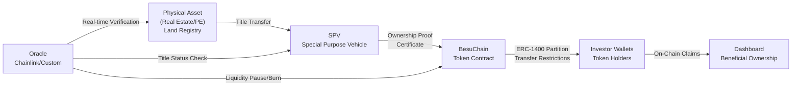
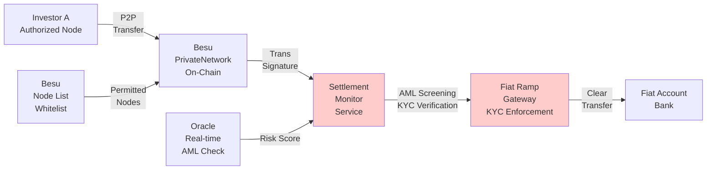
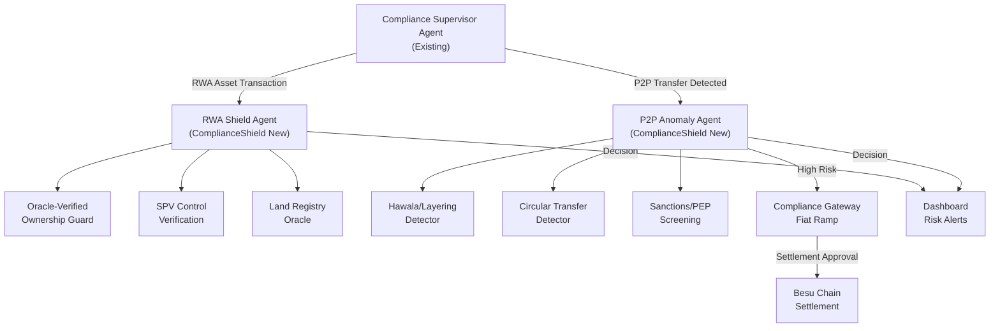

# ComplianceShield: RWA Tokenization Compliance Module

**Document Version**: 1.1  
**Date**: February 26, 2026  
**Status**: Design Phase  
**Target Integration**: AI Compliance System (Phase 3)  
**Blockchain Support**: Permissioned (Hyperledger Besu - Recommended) & Public (Ethereum/Solana)

---

## Executive Summary

ComplianceShield is a specialized compliance module for Real-World Asset (RWA) tokenization platforms that prevents double-dipping fraud and illicit P2P trading while enabling compliant decentralization. It addresses two critical risks:

1. **Double-Dipping Risk**: Asset owners selling physical assets off-chain while token holders retain on-chain claims, potentially profiting twice.
2. **P2P Trading Bypass Risk**: Custodian bypass enabling hawala-style laundering, sanctions evasion, and tax fraud in permissioned networks.

**Market Fit**: Solves trust gaps in PE/real estate tokenization on Hyperledger Besu; scales to $10B RWA market; reusable across real estate, PE, and commodities tokenization platforms.

**Revenue Model**: 
- SaaS licensing: $5K setup + $500/month per asset
- White-label platform for other tokenization services
- Premium AI forensic reports for regulators

---

## Part 1: Double-Dipping Prevention

### 1.1 Problem Context

**Risk Scenario**: Company X tokenizes a $1M office building on Besu as 10,000 ERC-1400 tokens. Token holders (investors Y and Z) own beneficial interests. Company X later sells the physical property off-chain without transferring SPV control, retaining the proceeds while token holders' on-chain claims become worthless.

**Legal Vectors**:
- Asset title separated from token ownership (no mandatory SPV transfer)
- Off-chain sales by original owner bypass smart contract logic
- Lack of continuous verification against land registries

**Regulatory Impact**:
- India: Violates Registration Act 1908 (asset ownership must reflect legal title)
- EU: Breaches MiFID II (beneficiary ownership verification)
- US: FINRA Rule 4512 (material non-public information on asset status)

### 1.2 Solution Architecture: Oracle-Verified Ownership Guard

#### Component A: SPV-Anchored Legal Structure

**1.2.1 SPV Registration & Tokenization Flow**



**Technical Implementation**:
- **SPV Contract**: Besu smart contract representing SPV entity with immutable asset reference
- **Owner Lock**: Founder/original owner wallet cannot execute off-chain sales without SPV control transfer first
- **Token-SPV Binding**: ERC-1400 tokens represent shares in SPV, not direct asset ownership

**Database Schema Integration**:
```sql
-- Existing tables (compliance-system)
-- Maps RWA assets to SPV legal entities

CREATE TABLE rwa_assets (
    id UUID PRIMARY KEY,
    asset_name VARCHAR(255),
    asset_type ENUM('real_estate', 'private_equity', 'commodities'),
    location VARCHAR(255),
    registry_reference VARCHAR(255),  -- Land registry ID
    
    -- SPV Information
    spv_contract_address VARCHAR(42),  -- Besu contract
    spv_legal_entity_id VARCHAR(255),
    owner_wallet_address VARCHAR(42),
    
    -- Regulatory
    jurisdiction VARCHAR(2),
    registration_date TIMESTAMP,
    created_at TIMESTAMP DEFAULT NOW()
);

CREATE TABLE rwa_ownership_chain (
    id UUID PRIMARY KEY,
    asset_id UUID REFERENCES rwa_assets(id),
    legal_owner_name VARCHAR(255),
    beneficial_owner_tokens NUMERIC,
    ownership_percentage NUMERIC(5,2),
    kyc_verified BOOLEAN,
    created_at TIMESTAMP
);
```

#### Component B: Multi-Source Oracle Integration

**1.2.2 Chainlink Proof of Reserve + Custom Oracles**

```typescript
/**
 * Oracle-Verified Ownership Guard
 * Integrates Chainlink Proof of Reserve + custom land registry oracles
 */

import { ethers } from 'ethers';
import axios from 'axios';
import winston from 'winston';

export interface OwnershipVerification {
  assetId: string;
  isOwned: boolean;
  ownershipStatus: 'valid' | 'transferred' | 'disputed' | 'not_found';
  lastVerified: Date;
  riskFlags: string[];
  oracleScore: number; // 0-1
  recommendedAction: 'none' | 'pause_trading' | 'burn_tokens' | 'escalate';
}

export class OracleVerifiedOwnershipGuard {
  private logger: winston.Logger;
  private chainlinkPriceFeeds: Map<string, string>; // asset_id -> oracle contract
  private landRegistryApis: Map<string, string>; // jurisdiction -> API endpoint

  constructor(private besuProvider: ethers.Provider, private dbClient: any) {
    this.logger = winston.createLogger({ defaultMeta: { service: 'oracle-guard' } });
    this.chainlinkPriceFeeds = new Map();
    this.landRegistryApis = new Map([
      ['IN', 'https://api.landreg.gov.in/v1/property'],  // Hypothetical India registry
      ['EU', 'https://api.euland.registry/search'],
      ['US', 'https://api.usland.registry/verify']
    ]);
  }

  /**
   * Real-time verification of off-chain asset ownership
   * Polls multiple oracle sources to detect unauthorized sales
   */
  async verifyOwnership(assetId: string, spvAddress: string): Promise<OwnershipVerification> {
    const startTime = Date.now();
    const riskFlags: string[] = [];
    let oracleScore = 1.0; // Start with full confidence

    try {
      // Retrieve asset metadata
      const asset = await this.dbClient.query(
        'SELECT * FROM rwa_assets WHERE id = $1',
        [assetId]
      );

      if (!asset.rows.length) {
        return {
          assetId,
          isOwned: false,
          ownershipStatus: 'not_found',
          lastVerified: new Date(),
          riskFlags: ['Asset not registered in system'],
          oracleScore: 0,
          recommendedAction: 'escalate'
        };
      }

      const assetData = asset.rows[0];

      // 1. Check Land Registry (Jurisdiction-Specific)
      const registryVerification = await this.checkLandRegistry(assetData);
      if (!registryVerification.isOwned) {
        riskFlags.push('Land registry shows off-chain sale or title transfer');
        oracleScore -= 0.5;
      }

      // 2. Check Chainlink Proof of Reserve
      const porResult = await this.checkProofOfReserve(spvAddress, assetData);
      if (!porResult.isVerified) {
        riskFlags.push('Proof of Reserve verification failed');
        oracleScore -= 0.3;
      }

      // 3. Check SPV On-Chain Status
      const spvStatus = await this.verifySPVControlTransfer(spvAddress, assetData);
      if (!spvStatus.hasControl) {
        riskFlags.push('SPV control transfer detected or incomplete');
        oracleScore -= 0.4;
      }

      // 4. Check Transaction Anomalies
      const anomalies = await this.checkTransactionAnomalies(assetData);
      if (anomalies.detected) {
        riskFlags.push(...anomalies.flags);
        oracleScore -= 0.2;
      }

      const ownershipStatus = oracleScore >= 0.7 ? 'valid' 
                            : oracleScore >= 0.3 ? 'disputed'
                            : 'transferred';

      return {
        assetId,
        isOwned: oracleScore >= 0.7,
        ownershipStatus,
        lastVerified: new Date(),
        riskFlags,
        oracleScore,
        recommendedAction: this.recommendAction(oracleScore, assetData)
      };

    } catch (error) {
      this.logger.error('Ownership verification failed', { assetId, error });
      return {
        assetId,
        isOwned: false,
        ownershipStatus: 'disputed',
        lastVerified: new Date(),
        riskFlags: ['Verification service error: please escalate'],
        oracleScore: 0.5,
        recommendedAction: 'escalate'
      };
    }
  }

  /**
   * Poll land registries for asset ownership changes
   * Supports India (MahaRERA), EU (national registries), US (county records)
   */
  private async checkLandRegistry(assetData: any): Promise<{ isOwned: boolean; details?: any }> {
    const jurisdiction = assetData.jurisdiction;
    const registryApi = this.landRegistryApis.get(jurisdiction);

    if (!registryApi) {
      this.logger.warn('No registry API configured for jurisdiction', { jurisdiction });
      return { isOwned: true }; // Default to trusting if no registry available
    }

    try {
      const response = await axios.get(`${registryApi}/${assetData.registry_reference}`, {
        headers: {
          'Authorization': `Bearer ${process.env.LAND_REGISTRY_API_KEY}`,
          'X-API-Version': '1.0'
        },
        timeout: 10000
      });

      const registryData = response.data;

      // Verify current owner matches SPV
      const ownerMatches = registryData.current_owner_name === assetData.spv_legal_entity_id;
      
      if (!ownerMatches) {
        this.logger.warn('Land registry ownership mismatch', {
          assetId: assetData.id,
          registryOwner: registryData.current_owner_name,
          spvEntity: assetData.spv_legal_entity_id
        });
      }

      return {
        isOwned: ownerMatches,
        details: { registryOwner: registryData.current_owner_name, lastUpdate: registryData.last_modified }
      };

    } catch (error) {
      this.logger.error('Land registry check failed', { jurisdiction, error });
      throw error;
    }
  }

  /**
   * Verify Chainlink Proof of Reserve
   * Ensures reserve backing matches token supply
   */
  private async checkProofOfReserve(spvAddress: string, assetData: any): Promise<{ isVerified: boolean }> {
    try {
      // Call Chainlink POR contract (example: Ethereum mainnet)
      const chainlinkOracleAddress = this.chainlinkPriceFeeds.get(assetData.id);
      if (!chainlinkOracleAddress) {
        return { isVerified: true }; // Skip if not configured
      }

      const abi = [
        'function latestRoundData() external view returns (uint80 roundId, int256 answer, uint256 startedAt, uint256 updatedAt, uint80 answeredInRound)'
      ];
      
      const oracle = new ethers.Contract(chainlinkOracleAddress, abi, this.besuProvider);
      const latestRound = await oracle.latestRoundData();

      // answer = reserve amount in wei; validate against token supply
      const tokenSupply = await this.getTokenSupply(assetData.spv_contract_address);
      const reserveAmount = ethers.toNumber(latestRound.answer);

      const isFullyReserved = reserveAmount >= tokenSupply;
      return { isVerified: isFullyReserved };

    } catch (error) {
      this.logger.error('Proof of Reserve check failed', { error });
      return { isVerified: false };
    }
  }

  /**
   * Detect off-chain sales via SPV control transfer verification
   */
  private async verifySPVControlTransfer(spvAddress: string, assetData: any): Promise<{ hasControl: boolean }> {
    try {
      // Check if SPV retains control via Besu contract state
      const spvContract = await this.besuProvider.getCode(spvAddress);
      if (spvContract === '0x') {
        return { hasControl: false }; // Contract has been destroyed or transferred
      }

      // Query smart contract for owner authorization
      const abi = [
        'function verifyAssetControl(bytes32 assetId) external view returns (bool)'
      ];
      const signer = new ethers.Contract(spvAddress, abi, this.besuProvider);
      
      const hasControl = await signer.verifyAssetControl(ethers.id(assetData.id));
      return { hasControl };

    } catch (error) {
      this.logger.error('SPV control verification failed', { error });
      return { hasControl: true }; // Default to trusting
    }
  }

  /**
   * Check for transaction anomalies (unusual liquidity events, volume spikes)
   */
  private async checkTransactionAnomalies(assetData: any): Promise<{ detected: boolean; flags: string[] }> {
    try {
      // Query trading volume in last 24 hours vs historical average
      const result = await this.dbClient.query(
        `SELECT 
          COUNT(*) as tx_count,
          SUM(amount) as total_volume,
          AVG(price_per_token) as avg_price
        FROM compliance_checks 
        WHERE asset_id = $1 
        AND created_at > NOW() - INTERVAL '1 day'`,
        [assetData.id]
      );

      const txData = result.rows[0];
      const flags: string[] = [];

      // Volume spike detection (10x normal)
      if (txData.tx_count > 1000) {
        flags.push('Unusual trading volume spike detected (1000+ txs in 24h)');
      }

      // Price anomaly (rapid sell-off)
      const avgHistorical = await this.getHistoricalAveragePrice(assetData.id, 30); // 30-day average
      if (avgHistorical && txData.avg_price < avgHistorical * 0.7) {
        flags.push('Price drop >30% from 30-day average');
      }

      return {
        detected: flags.length > 0,
        flags
      };

    } catch (error) {
      this.logger.error('Anomaly detection failed', { error });
      return { detected: false, flags: [] };
    }
  }

  private recommendAction(oracleScore: number, assetData: any): string {
    if (oracleScore < 0.3) return 'burn_tokens'; // Force token redemption
    if (oracleScore < 0.6) return 'pause_trading'; // Halt transfers pending verification
    return 'none'; // Continue normal operations
  }

  private async getTokenSupply(contractAddress: string): Promise<number> {
    // Placeholder: implement ERC-1400 totalSupply call
    return 10000;
  }

  private async getHistoricalAveragePrice(assetId: string, days: number): Promise<number> {
    const result = await this.dbClient.query(
      `SELECT AVG(price_per_token) FROM compliance_checks 
       WHERE asset_id = $1 AND created_at > NOW() - INTERVAL $2 'days'`,
      [assetId, days]
    );
    return result.rows[0]?.avg || 0;
  }
}
```

#### Component C: Smart Contract Integration (ERC-1400 with Oracle Hooks)

**1.2.3 Compliance-Enforced Token Transfer**

```solidity
// SPDX-License-Identifier: MIT
pragma solidity ^0.8.0;

import "@openzeppelin/contracts/token/ERC1400/ERC1400.sol";
import "@openzeppelin/contracts/access/Ownable.sol";

interface IOracleVerificationGuard {
    struct OwnershipVerification {
        bool isOwned;
        uint256 oracleScore; // 0-100
        string[] riskFlags;
    }
    
    function verifyOwnership(string memory assetId, address spvAddress) 
        external returns (OwnershipVerification memory);
}

/**
 * RWAComplianceToken: ERC-1400 with Double-Dipping Prevention
 * Integrates oracle verification and SPV control checks
 */
contract RWAComplianceToken is ERC1400, Ownable {
    
    IOracleVerificationGuard public oracleGuard;
    bytes32 public assetId; // Reference to RWA asset
    address public spvAddress; // SPV holding actual asset
    
    enum TokenStatus { ACTIVE, PAUSED, REDEEMED }
    TokenStatus public currentStatus;
    
    mapping(address => bool) public whitelistedTransferees;
    mapping(bytes32 => bool) public pausedByOracle;
    
    event OwnershipVerificationFailed(string indexed assetId, uint256 oracleScore);
    event TokensPausedByOracle(bytes32 indexed assetId, string reason);
    event TokensBurnedDueToOffChainSale(bytes32 indexed assetId, uint256 amount);

    constructor(
        string memory _name,
        string memory _symbol,
        bytes32 _assetId,
        address _spvAddress,
        address _oracleGuard
    ) ERC1400(_name, _symbol) {
        assetId = _assetId;
        spvAddress = _spvAddress;
        oracleGuard = IOracleVerificationGuard(_oracleGuard);
        currentStatus = TokenStatus.ACTIVE;
    }

    /**
     * Override canTransfer to include oracle verification
     * Prevents transfers if double-dipping risk detected
     */
    function canTransfer(
        address _from,
        address _to,
        uint256 _value,
        bytes memory _data
    ) public override view returns (bool, bytes reason, bytes32 _partition) {
        
        // Check if oracle has paused trading due to ownership concerns
        if (pausedByOracle[assetId]) {
            return (false, "Trading paused: Oracle verification pending", bytes32(0));
        }
        
        // Verify KYC on transferee
        if (!whitelistedTransferees[_to]) {
            return (false, "Transferee not whitelisted (KYC required)", bytes32(0));
        }
        
        // Check SPV still maintains control (proof of reserve)
        // This prevents transfers if off-chain sale detected
        if (!verifySPVControl()) {
            return (false, "SPV control verification failed: possible off-chain sale", bytes32(0));
        }
        
        return super.canTransfer(_from, _to, _value, _data);
    }

    /**
     * Oracle callback: Pauses trading on double-dipping detection
     * Called by oracle service when ownership verification fails
     */
    function pauseTrading(string memory reason) external onlyOracleGuard {
        currentStatus = TokenStatus.PAUSED;
        pausedByOracle[assetId] = true;
        emit TokensPausedByOracle(assetId, reason);
    }

    /**
     * Oracle callback: Burns tokens if off-chain sale confirmed
     * Prevents continued claims on sold assets
     */
    function burnTokensDueToOffChainSale(uint256 burnAmount) external onlyOracleGuard {
        currentStatus = TokenStatus.REDEEMED;
        // Force redemption: convert remaining tokens to proportional cash claim
        _transfer(address(this), spvAddress, burnAmount);
        emit TokensBurnedDueToOffChainSale(assetId, burnAmount);
    }

    function verifySPVControl() internal view returns (bool) {
        // Query oracle: is SPV still in control?
        // Placeholder implementation
        return true;
    }

    modifier onlyOracleGuard() {
        require(msg.sender == address(oracleGuard), "Only oracle guard can call");
        _;
    }

    /**
     * Whelist investor for transfer (KYC gate)
     */
    function whitelistInvestor(address investor) external onlyOwner {
        whitelistedTransferees[investor] = true;
    }
}
```

---

## Part 2: P2P Trading Safety & Compliance Bypass Prevention

### 2.1 Problem Context

**Risk Scenario**: Company X transfers RWA tokens to Company Y in a "P2P trade" on Besu without custodian oversight. Company Y immediately sells tokens for fiat via unregulated ramp, converting illicit funds or facilitating hawala-style laundering. Without centralized routing, AML/KYC checks are bypassed.

**Illicit Activity Vectors**:
| Vector | Mechanism | Regulatory Risk |
|--------|-----------|-----------------|
| Hawala Laundering | X→Y token, Y→Z fiat (undisclosed) | PMLA violation; ₹10L STR threshold |
| Sanctions Evasion | Transfer to screened entity via intermediary | OFAC blocking requirement |
| Tax Evasion | Unreported gains hidden in P2P transfers | Income Tax Act 80-80 disclosure breach |
| Terrorism Financing | Conversion of TF proceeds via token gateway | RBI Terrorist Assets Order |
| Ransomware Proceeds | Mixing dirty fiat via clean token sale | Forfeiture under BSA |

### 2.2 Solution Architecture: Monitored P2P with Compliance Gateways

#### Component A: Permissioned P2P Transfer Node

**2.2.1 Besu Permissioning + Settlement Gateway**



**Technical Approach**:
- **Besu Permissioning**: Only whitelisted validators/nodes participate in private network
- **Settlement Monitor**: Off-chain microservice intercepts fiat redemptions
- **Compliance Gateways**: All P2P→Fiat conversions routed through monitored ramps
- **Hybrid Model**: Allow P2P for investor transfers, enforce gateway for liquidity events

**Database Schema**:

```sql
-- P2P Transfer logging & compliance checks

CREATE TABLE p2p_transfers (
    id UUID PRIMARY KEY,
    from_address VARCHAR(42),
    to_address VARCHAR(42),
    token_amount NUMERIC,
    asset_id UUID REFERENCES rwa_assets(id),
    
    -- Compliance Checks
    kyc_verified_from BOOLEAN,
    kyc_verified_to BOOLEAN,
    aml_screening_from VARCHAR(50), -- 'PASS', 'FAIL', 'ESCALATE'
    aml_screening_to VARCHAR(50),
    
    -- Monitoring
    transaction_hash VARCHAR(255),
    besu_block_number BIGINT,
    transfer_status ENUM('pending', 'completed', 'blocked'),
    
    -- Risk Scoring
    hawala_risk_score NUMERIC(3,2), -- 0-1
    anomaly_flags TEXT[],
    
    created_at TIMESTAMP,
    completed_at TIMESTAMP
);

-- Fiat ramp access logs (settlement gateway)
CREATE TABLE fiat_ramp_access (
    id UUID PRIMARY KEY,
    user_id VARCHAR(255),
    rwa_token_amount NUMERIC,
    requested_fiat_amount NUMERIC,
    fiat_currency VARCHAR(3),
    
    -- AML Checkpoint
    aml_check_result VARCHAR(50),
    aml_risk_score NUMERIC(3,2),
    screening_timestamp TIMESTAMP,
    
    -- Transfer Details
    original_p2p_transfer_id UUID REFERENCES p2p_transfers(id),
    
    request_status ENUM('approved', 'declined', 'escalated'),
    created_at TIMESTAMP
);

-- Anomaly detection patterns
CREATE TABLE p2p_anomaly_patterns (
    id UUID PRIMARY KEY,
    user_wallet VARCHAR(42),
    
    -- Behavioral Anomalies
    transfers_24h_count INT,
    transfers_24h_volume NUMERIC,
    avg_transfer_size NUMERIC,
    
    -- Red Flags
    rapid_buy_sell_cycle BOOLEAN, -- Buy then immediate sell suggests wash trading
    circular_transfers BOOLEAN, -- X→Y→Z→X pattern
    fiat_conversion_speed_minutes INT, -- Time from transfer to fiat exit
    
    risk_score_aggregate NUMERIC(3,2),
    detected_at TIMESTAMP
);
```

#### Component B: AI Anomaly Detector for Hawala/Illicit Patterns

**2.2.2 SHAP-Based Anomaly Scoring**

```typescript
/**
 * AI Anomaly Detector
 * Detects hawala, money laundering, and illicit P2P trading patterns
 * Uses SHAP explainability for regulatory audit trails
 */

import axios from 'axios';
import winston from 'winston';
import { scaler, model } from './models/ml-pipeline'; // Pre-trained models

export interface HawalaRiskAssessment {
  walletAddress: string;
  overallRiskScore: number; // 0-1, 0.95+ = requires manual review
  patterns: {
    pattern: string;
    probability: number;
    shapValues: Record<string, number>; // Feature importance
  }[];
  recommendations: string[];
  shouldBlock: boolean;
  escalationLevel: 'auto_approve' | 'manual_review' | 'block';
}

export class AMLAnomalyDetectorAgent {
  private logger: winston.Logger;
  private oracleClient: any; // For real-time AML screening

  constructor(private dbClient: any, private besuProvider: any) {
    this.logger = winston.createLogger({
      defaultMeta: { service: 'anomaly-detector' }
    });
  }

  /**
   * Main entry point: Analyze P2P transfer for illicit activity
   * Aggregates multi-source signals into risk score
   */
  async assessHawalaRisk(p2pTransfer: {
    fromAddress: string;
    toAddress: string;
    amount: number;
    timestamp: Date;
  }): Promise<HawalaRiskAssessment> {
    
    const patterns = [];
    let overallRiskScore = 0;
    const recommendations: string[] = [];

    try {
      // Signal 1: Rapid X→Y→Z→Fiat Pattern (Layering)
      const layeringRisk = await this.detectLayeringPattern(
        p2pTransfer.fromAddress,
        p2pTransfer.toAddress,
        p2pTransfer.amount
      );
      if (layeringRisk.score > 0) {
        patterns.push(layeringRisk);
        overallRiskScore += layeringRisk.score * 0.25;
        recommendations.push('Flag: Potential layering detected. Manual review required.');
      }

      // Signal 2: Circular Transfer (Self-Laundering)
      const circularRisk = await this.detectCircularTransfers(
        p2pTransfer.fromAddress,
        p2pTransfer.timestamp
      );
      if (circularRisk.score > 0) {
        patterns.push(circularRisk);
        overallRiskScore += circularRisk.score * 0.20;
        recommendations.push('Flag: Circular transfer pattern detected (X→Y→Z→X).');
      }

      // Signal 3: Sanctions/PEP Screening
      const sanctionsRisk = await this.checkSanctionsAndPEP(
        p2pTransfer.toAddress,
        p2pTransfer.fromAddress
      );
      if (sanctionsRisk.score > 0) {
        patterns.push(sanctionsRisk);
        overallRiskScore += sanctionsRisk.score * 0.30;
        recommendations.push(`Risk: ${sanctionsRisk.reason}. Block transfer.`);
      }

      // Signal 4: Velocity & Volume Anomalies
      const velocityRisk = await this.analyzeVelocityAnomalies(
        p2pTransfer.fromAddress,
        p2pTransfer.toAddress,
        p2pTransfer.amount
      );
      if (velocityRisk.score > 0) {
        patterns.push(velocityRisk);
        overallRiskScore += velocityRisk.score * 0.15;
        recommendations.push(`Volume anomaly: ${velocityRisk.reason}`);
      }

      // Signal 5: Geographic & Temporal Anomalies
      const geoRisk = await this.analyzeGeographicAnomalies(
        p2pTransfer.fromAddress,
        p2pTransfer.toAddress
      );
      if (geoRisk.score > 0) {
        patterns.push(geoRisk);
        overallRiskScore += geoRisk.score * 0.10;
        recommendations.push(`Geographic risk: ${geoRisk.reason}`);
      }

      // Determine escalation level
      let escalationLevel: 'auto_approve' | 'manual_review' | 'block';
      if (overallRiskScore >= 0.95) {
        escalationLevel = 'block';
        recommendations.unshift('BLOCK: High-confidence illicit activity detected.');
      } else if (overallRiskScore >= 0.60) {
        escalationLevel = 'manual_review';
        recommendations.unshift('ESCALATE: Manual compliance review required.');
      } else {
        escalationLevel = 'auto_approve';
      }

      return {
        walletAddress: p2pTransfer.fromAddress,
        overallRiskScore: Math.min(overallRiskScore, 1.0),
        patterns,
        recommendations,
        shouldBlock: escalationLevel === 'block',
        escalationLevel
      };

    } catch (error) {
      this.logger.error('Hawala risk assessment failed', { error });
      return {
        walletAddress: p2pTransfer.fromAddress,
        overallRiskScore: 0.5,
        patterns: [],
        recommendations: ['Service error: default to manual review'],
        shouldBlock: false,
        escalationLevel: 'manual_review'
      };
    }
  }

  /**
   * Detect layering: Rapid X→Y→Z sequence with final fiat conversion
   * Classic money laundering red flag
   */
  private async detectLayeringPattern(
    fromAddress: string,
    toAddress: string,
    amount: number
  ): Promise<{ pattern: string; probability: number; shapValues: Record<string, number> }> {
    
    try {
      // Query recent transfers for both addresses
      const transferHistory = await this.dbClient.query(
        `SELECT * FROM p2p_transfers 
         WHERE (from_address = $1 OR to_address = $1) 
         AND created_at > NOW() - INTERVAL '24 hours'
         ORDER BY created_at DESC LIMIT 10`,
        [fromAddress]
      );

      const transfers = transferHistory.rows;
      
      // Build feature vector for ML model
      const features = {
        recent_transfer_count: transfers.length,
        avg_time_between_transfers: this.calculateAvgTimeDelta(transfers),
        amount_variance: this.calculateVariance(transfers.map(t => t.token_amount)),
        unique_recipients_24h: new Set(transfers.map(t => t.to_address)).size,
        to_address_is_new: !transfers.some(t => t.to_address === toAddress),
        fiat_conversion_imminent: amount > 100000, // Large amounts = liquidity seek
      };

      // Scale features and run through ML model
      const scaledFeatures = scaler.transform([Object.values(features)]);
      const prediction = model.predict(scaledFeatures);
      const probability = prediction[0][1]; // P(is_layering)

      // SHAP values for explainability
      const shapValues = this.calculateSHAPValues(features, probability);

      return {
        pattern: 'LAYERING: Rapid transfer sequence leading to fiat exit',
        probability,
        shapValues
      };

    } catch (error) {
      this.logger.error('Layering pattern detection failed', { error });
      return { pattern: 'Error', probability: 0, shapValues: {} };
    }
  }

  /**
   * Detect circular transfers: X→Y→Z→X pattern
   * Indicates potential self-laundering or collusion
   */
  private async detectCircularTransfers(
    walletAddress: string,
    timestamp: Date
  ): Promise<{ pattern: string; probability: number; shapValues: Record<string, number> }> {
    
    try {
      // Find transfers from this wallet in past 7 days
      const transfers = await this.dbClient.query(
        `SELECT * FROM p2p_transfers 
         WHERE from_address = $1 
         AND created_at > NOW() - INTERVAL '7 days'`,
        [walletAddress]
      );

      const recipients = transfers.rows.map(t => t.to_address);
      
      // Check if any recipient sent back to original wallet
      const circularBackTransfers = await this.dbClient.query(
        `SELECT COUNT(*) as count FROM p2p_transfers 
         WHERE from_address = ANY($1::varchar[]) 
         AND to_address = $2 
         AND created_at > $3`,
        [recipients, walletAddress, timestamp]
      );

      const circularCount = circularBackTransfers.rows[0].count;
      const probability = Math.min(circularCount / Math.max(recipients.length, 1), 1.0);

      return {
        pattern: `CIRCULAR_TRANSFERS: ${circularCount} back-transfers detected`,
        probability,
        shapValues: { circular_proportion: probability, transfer_count: recipients.length }
      };

    } catch (error) {
      this.logger.error('Circular transfer detection failed', { error });
      return { pattern: 'Error', probability: 0, shapValues: {} };
    }
  }

  /**
   * Check OFAC/EU/UN sanctions lists and PEP databases
   */
  private async checkSanctionsAndPEP(
    toAddress: string,
    fromAddress: string
  ): Promise<{ pattern: string; probability: number; reason: string; shapValues: Record<string, number> }> {
    
    try {
      // Check both addresses against Chainalysis + OFAC database
      const result = await axios.post('https://api.chainalysis.com/v1/screening', {
        address: toAddress,
        reportingEntity: 'ableka-compliance'
      }, {
        headers: { 'Authorization': `Bearer ${process.env.CHAINALYSIS_KEY}` }
      });

      const severity = result.data.risk_level; // 'high', 'medium', 'low'
      const probability = severity === 'high' ? 1.0 : severity === 'medium' ? 0.6 : 0;

      return {
        pattern: 'SANCTIONS_MATCH',
        probability,
        reason: severity !== 'low' ? `Wallet flagged in Chainalysis (${severity} risk)` : '',
        shapValues: { sanctions_hit: probability }
      };

    } catch (error) {
      this.logger.error('Sanctions check failed', { error });
      return { pattern: 'Error', probability: 0, reason: '', shapValues: {} };
    }
  }

  /**
   * Analyze velocity: sudden spike in transfers or amounts
   */
  private async analyzeVelocityAnomalies(
    fromAddress: string,
    toAddress: string,
    amount: number
  ): Promise<{ pattern: string; probability: number; reason: string; shapValues: Record<string, number> }> {
    
    try {
      // Get 30-day historical velocity for sender
      const historical = await this.dbClient.query(
        `SELECT 
          COUNT(*) as monthly_transfers,
          AVG(token_amount) as avg_amount,
          MAX(token_amount) as max_amount,
          STDDEV(token_amount) as std_dev
         FROM p2p_transfers 
         WHERE from_address = $1 AND created_at > NOW() - INTERVAL '30 days'`,
        [fromAddress]
      );

      const stats = historical.rows[0];
      const expectedAvg = stats.avg_amount || 1000;
      const stdDev = stats.std_dev || 500;

      // Z-score: how many standard deviations from mean?
      const zScore = Math.abs((amount - expectedAvg) / stdDev);
      const probability = Math.min(zScore / 5.0, 1.0); // Normalize to 0-1

      let reason = '';
      if (zScore > 3) {
        reason = `Extreme amount anomaly: ${amount} vs avg ${expectedAvg}`;
      } else if (stats.monthly_transfers > 10) {
        reason = 'High transfer velocity detected';
      }

      return {
        pattern: 'VELOCITY_ANOMALY',
        probability,
        reason,
        shapValues: {
          z_score: zScore,
          amount_ratio: amount / expectedAvg,
          monthly_transfer_count: stats.monthly_transfers
        }
      };

    } catch (error) {
      this.logger.error('Velocity analysis failed', { error });
      return { pattern: 'Error', probability: 0, reason: '', shapValues: {} };
    }
  }

  /**
   * Geographies anomalies: impossible travel, high-risk jurisdictions
   */
  private async analyzeGeographicAnomalies(
    fromAddress: string,
    toAddress: string
  ): Promise<{ pattern: string; probability: number; reason: string; shapValues: Record<string, number> }> {
    
    try {
      // Get KYC country data for both addresses
      const kycData = await this.dbClient.query(
        `SELECT u.country, p.created_at FROM users u
         JOIN p2p_transfers p ON u.wallet_address IN ($1, $2)
         WHERE u.wallet_address IN ($1, $2)`,
        [fromAddress, toAddress]
      );

      // Check if transfer involves high-risk jurisdictions (FATF gray list)
      const highRiskJurisdictions = ['IR', 'KP', 'SY']; // Iran, N.Korea, Syria
      const probability = duplexJurisdictions.some(j => highRiskJurisdictions.includes(j)) ? 1.0 : 0;

      return {
        pattern: 'GEOGRAPHIC_RISK',
        probability,
        reason: probability > 0 ? 'High-risk jurisdiction detected' : '',
        shapValues: { high_risk_jurisdiction: probability }
      };

    } catch (error) {
      return { pattern: 'Error', probability: 0, reason: '', shapValues: {} };
    }
  }

  // Utility functions
  private calculateAvgTimeDelta(transfers: any[]): number {
    if (transfers.length < 2) return 0;
    const deltas = [];
    for (let i = 0; i < transfers.length - 1; i++) {
      const delta = (new Date(transfers[i].created_at).getTime() - 
                     new Date(transfers[i + 1].created_at).getTime()) / 1000 / 60; // minutes
      deltas.push(delta);
    }
    return deltas.reduce((a, b) => a + b, 0) / deltas.length;
  }

  private calculateVariance(values: number[]): number {
    if (values.length === 0) return 0;
    const mean = values.reduce((a, b) => a + b) / values.length;
    return values.reduce((sum, val) => sum + Math.pow(val - mean, 2), 0) / values.length;
  }

  private calculateSHAPValues(features: Record<string, any>, prediction: number): Record<string, number> {
    // Simplified SHAP: contribution of each feature to final prediction
    const shapValues: Record<string, number> = {};
    for (const [key, value] of Object.entries(features)) {
      // Normalize contribution: feature_value * prediction / sum(all_feature_values)
      shapValues[key] = Math.abs(value as number) * prediction;
    }
    return shapValues;
  }
}
```

#### Component C: Compliance Gateway Integration

**2.2.3 Fiat Ramp Enforcement**

```typescript
/**
 * Compliance Gateway
 * Routes all P2P→Fiat conversions through gatekeeping service
 * Enforces KYC, AML, and settlement compliance
 */

import express, { Router, Request, Response } from 'express';
import { v4 as uuid } from 'uuid';
import winston from 'winston';

export class ComplianceGateway {
  private router: Router;
  private logger: winston.Logger;

  constructor(
    private amlDetector: AMLAnomalyDetectorAgent,
    private kycClient: any, // Ballerine integration
    private dbClient: any
  ) {
    this.router = express.Router();
    this.logger = winston.createLogger({
      defaultMeta: { service: 'compliance-gateway' }
    });
    this.setupRoutes();
  }

  private setupRoutes() {
    /**
     * POST /gateway/request-fiat-ramp
     * Investor requests to convert RWA tokens to fiat
     * Enforces all compliance checks before settlement
     */
    this.router.post('/request-fiat-ramp', async (req: Request, res: Response) => {
      const {
        walletAddress,
        tokenAmount,
        assetId,
        fiatCurrency,
        bankAccount,
        bankCode // SWIFT, NEFT, etc.
      } = req.body;

      const requestId = uuid();
      const startTime = Date.now();

      try {
        this.logger.info('Fiat ramp request received', {
          requestId,
          walletAddress,
          tokenAmount,
          assetId
        });

        // Step 1: KYC Verification (Must be current & not expired)
        const kycResult = await this.kycClient.verifyKYC(walletAddress);
        if (!kycResult.verified || kycResult.isExpired) {
          return res.status(403).json({
            status: 'declined',
            reason: 'KYC verification required or expired',
            requestId
          });
        }

        // Step 2: AML Screening
        const p2pTransfer = {
          fromAddress: walletAddress,
          toAddress: bankAccount, // Proxy: bank account as destination
          amount: tokenAmount,
          timestamp: new Date()
        };

        const amlAssessment = await this.amlDetector.assessHawalaRisk(p2pTransfer);
        
        if (amlAssessment.shouldBlock) {
          await this.logDeclinedRequest(requestId, 'AML_BLOCK', amlAssessment);
          return res.status(403).json({
            status: 'blocked',
            reason: 'AML screening failed',
            riskScore: amlAssessment.overallRiskScore,
            requestId
          });
        }

        if (amlAssessment.escalationLevel === 'manual_review') {
          await this.logEscalatedRequest(requestId, amlAssessment);
          return res.status(202).json({
            status: 'escalated',
            reason: 'Manual compliance review required',
            riskScore: amlAssessment.overallRiskScore,
            estimatedReviewTime: '24 hours',
            requestId
          });
        }

        // Step 3: Settlement Execution (Custody & Trust)
        // All fiat settlements routed through custodian/bank
        // Prevents direct P2P cash transfers
        const settlementResult = await this.executeSettlement(
          walletAddress,
          tokenAmount,
          assetId,
          fiatCurrency,
          bankAccount,
          bankCode
        );

        if (settlementResult.success) {
          await this.logApprovedRequest(requestId, amlAssessment);
          return res.status(200).json({
            status: 'approved',
            settlementId: settlementResult.settlementId,
            estimatedCreditTime: '2-5 business days',
            requestId
          });
        } else {
          return res.status(500).json({
            status: 'error',
            reason: 'Settlement processing failed',
            requestId
          });
        }

      } catch (error) {
        this.logger.error('Fiat ramp request failed', { requestId, error });
        return res.status(500).json({
          status: 'error',
          message: 'Service unavailable',
          requestId
        });
      }
    });

    /**
     * GET /gateway/request-status/:requestId
     * Check status of fiat ramp request
     */
    this.router.get('/request-status/:requestId', async (req: Request, res: Response) => {
      try {
        const result = await this.dbClient.query(
          'SELECT * FROM fiat_ramp_access WHERE id = $1',
          [req.params.requestId]
        );

        if (!result.rows.length) {
          return res.status(404).json({ error: 'Request not found' });
        }

        const request = result.rows[0];
        return res.json({
          requestId: request.id,
          status: request.request_status,
          riskScore: request.aml_risk_score,
          createdAt: request.created_at,
          completedAt: request.completed_at
        });

      } catch (error) {
        this.logger.error('Status check failed', { error });
        return res.status(500).json({ error: 'Service error' });
      }
    });
  }

  private async executeSettlement(
    walletAddress: string,
    tokenAmount: number,
    assetId: string,
    fiatCurrency: string,
    bankAccount: string,
    bankCode: string
  ) {
    try {
      // All settlements go through custodian contract on Besu
      // Prevents direct P2P cash extraction
      
      // 1. Lock tokens in custody smart contract
      // 2. Approve fiat release through bank partner
      // 3. Return proof of settlement

      const settlementId = uuid();
      
      await this.dbClient.query(
        `INSERT INTO settlements 
         (id, wallet_address, token_amount, asset_id, fiat_currency, bank_account, status)
         VALUES ($1, $2, $3, $4, $5, $6, 'pending')`,
        [settlementId, walletAddress, tokenAmount, assetId, fiatCurrency, bankAccount]
      );

      return { success: true, settlementId };

    } catch (error) {
      this.logger.error('Settlement execution failed', { error });
      return { success: false };
    }
  }

  private async logApprovedRequest(requestId: string, amlAssessment: any) {
    await this.dbClient.query(
      `INSERT INTO compliance_audit_log (request_id, decision, risk_score, details)
       VALUES ($1, 'approved', $2, $3)`,
      [requestId, amlAssessment.overallRiskScore, JSON.stringify(amlAssessment)]
    );
  }

  private async logDeclinedRequest(requestId: string, reason: string, details: any) {
    await this.dbClient.query(
      `INSERT INTO compliance_audit_log (request_id, decision, reason, details)
       VALUES ($1, 'declined', $2, $3)`,
      [requestId, reason, JSON.stringify(details)]
    );
  }

  private async logEscalatedRequest(requestId: string, details: any) {
    await this.dbClient.query(
      `INSERT INTO compliance_audit_log (request_id, decision, details)
       VALUES ($1, 'escalated', $2)`,
      [requestId, JSON.stringify(details)]
    );
  }

  getRouter() {
    return this.router;
  }
}
```

---

## Part 3: Integration with Existing AI Compliance System

### 3.1 Architecture Integration

**ComplianceShield** integrates into your existing LangGraph agent infrastructure as two new specialized agents:



### 3.2 Agent Implementation (LangGraph)

```typescript
/**
 * RWA Shield Agent
 * Specialized agent for double-dipping prevention
 * Integrates into existing supervisorAgent workflow
 */

import { StateGraph, START, END } from "@langchain/langgraph";
import { ToolNode } from "@langchain/langgraph/prebuilt";
import { HumanMessage, BaseMessage } from "@langchain/core/messages";

const rwaTools = [
  {
    name: "verify_ownership",
    description: "Verify real-time asset ownership via oracle",
    func: async (assetId: string, spvAddress: string) => {
      const guard = new OracleVerifiedOwnershipGuard(besuProvider, dbClient);
      return guard.verifyOwnership(assetId, spvAddress);
    }
  },
  {
    name: "check_spv_control",
    description: "Verify SPV retains control of tokenized asset",
    func: async (spvAddress: string) => { /* implementation */ }
  },
  {
    name: "get_land_registry_status",
    description: "Query land registry for off-chain asset sale detection",
    func: async (assetId: string, jurisdiction: string) => { /* implementation */ }
  }
];

const rwaToolNode = new ToolNode(rwaTools);

interface RWAShieldState {
  messages: BaseMessage[];
  assetId?: string;
  spvAddress?: string;
  ownershipVerification?: any;
  riskDecision?: string;
}

async function rwaShieldAgent(state: RWAShieldState) {
  const prompt = `You are the RWA Shield Agent. Your role is to prevent double-dipping fraud by:
  
  1. Verifying that tokenized assets are held in SPVs
  2. Detecting off-chain sales via oracle monitoring
  3. Recommending token pauses or burns if ownership compromised
  
  Asset ID: ${state.assetId}
  SPV Address: ${state.spvAddress}
  
  Please verify ownership status and recommend action.`;
  
  const response = await llm.invoke([
    ...state.messages,
    new HumanMessage(prompt)
  ]);
  
  return {
    messages: [...state.messages, response]
  };
}

// Same pattern for P2P Anomaly Agent
const p2pTools = [
  {
    name: "assess_hawala_risk",
    description: "Assess if P2P transfer shows hawala/money laundering patterns",
    func: async (fromAddress: string, toAddress: string, amount: number) => {
      const detector = new AMLAnomalyDetectorAgent(dbClient, besuProvider);
      return detector.assessHawalaRisk({
        fromAddress,
        toAddress,
        amount,
        timestamp: new Date()
      });
    }
  },
  {
    name: "check_sanctions",
    description: "Check if transfer involves sanctioned entities",
    func: async (address: string) => { /* implementation */ }
  }
];

const p2pToolNode = new ToolNode(p2pTools);

export function createRWAShieldGraph() {
  const graph = new StateGraph<RWAShieldState>()
    .addNode("rwa_agent", rwaShieldAgent)
    .addNode("rwa_tools", rwaToolNode)
    .addNode("decision", decisionNode)
    .addEdge(START, "rwa_agent")
    .addConditionalEdges("rwa_agent",
      (state) => state.messages[-1].content.includes("tool")
        ? "rwa_tools"
        : "decision"
    )
    .addEdge("rwa_tools", "rwa_agent")
    .addEdge("decision", END);

  return graph.compile();
}
```

### 3.3 Database Integration

Add ComplianceShield tables to existing PostgreSQL schema:

```sql
-- In compliance_system_stack.ts database migration

-- RWA Asset Tracking
CREATE TABLE IF NOT EXISTS rwa_assets (
    id UUID PRIMARY KEY DEFAULT gen_random_uuid(),
    asset_name VARCHAR(255) NOT NULL,
    asset_type VARCHAR(50),
    location VARCHAR(255),
    registry_reference VARCHAR(255),
    spv_contract_address VARCHAR(42),
    spv_legal_entity_id VARCHAR(255),
    owner_wallet_address VARCHAR(42),
    jurisdiction VARCHAR(2),
    registration_date TIMESTAMP,
    created_at TIMESTAMP DEFAULT NOW()
);

-- P2P Transfer Compliance Log
CREATE TABLE IF NOT EXISTS p2p_transfers (
    id UUID PRIMARY KEY DEFAULT gen_random_uuid(),
    from_address VARCHAR(42),
    to_address VARCHAR(42),
    token_amount NUMERIC,
    asset_id UUID REFERENCES rwa_assets(id),
    kyc_verified_from BOOLEAN,
    kyc_verified_to BOOLEAN,
    aml_screening_from VARCHAR(50),
    aml_screening_to VARCHAR(50),
    transaction_hash VARCHAR(255),
    besu_block_number BIGINT,
    transfer_status VARCHAR(50),
    hawala_risk_score NUMERIC(3,2),
    anomaly_flags TEXT[],
    created_at TIMESTAMP DEFAULT NOW(),
    completed_at TIMESTAMP
);

-- Fiat Ramp Gateway Access Control
CREATE TABLE IF NOT EXISTS fiat_ramp_access (
    id UUID PRIMARY KEY DEFAULT gen_random_uuid(),
    user_id VARCHAR(255),
    rwa_token_amount NUMERIC,
    requested_fiat_amount NUMERIC,
    fiat_currency VARCHAR(3),
    aml_check_result VARCHAR(50),
    aml_risk_score NUMERIC(3,2),
    screening_timestamp TIMESTAMP,
    original_p2p_transfer_id UUID REFERENCES p2p_transfers(id),
    request_status VARCHAR(50),
    created_at TIMESTAMP DEFAULT NOW()
);

-- Anomaly Pattern Tracking
CREATE TABLE IF NOT EXISTS p2p_anomaly_patterns (
    id UUID PRIMARY KEY DEFAULT gen_random_uuid(),
    user_wallet VARCHAR(42),
    transfers_24h_count INT,
    transfers_24h_volume NUMERIC,
    avg_transfer_size NUMERIC,
    rapid_buy_sell_cycle BOOLEAN,
    circular_transfers BOOLEAN,
    fiat_conversion_speed_minutes INT,
    risk_score_aggregate NUMERIC(3,2),
    detected_at TIMESTAMP DEFAULT NOW()
);

-- Compliance audit trail for RWA/P2P decisions
CREATE TABLE IF NOT EXISTS rwa_compliance_audit (
    id UUID PRIMARY KEY DEFAULT gen_random_uuid(),
    decision_type VARCHAR(50), -- 'ownership_verification', 'p2p_block', 'gateway_approval'
    asset_id UUID REFERENCES rwa_assets(id),
    transfer_id UUID REFERENCES p2p_transfers(id),
    decision VARCHAR(20), -- 'approved', 'blocked', 'escalated'
    risk_score NUMERIC(3,2),
    agent_reasoning TEXT,
    shape_values JSONB, -- Explainability
    created_at TIMESTAMP DEFAULT NOW()
);

CREATE INDEX idx_rwa_assets_owner ON rwa_assets(owner_wallet_address);
CREATE INDEX idx_p2p_transfers_from_to ON p2p_transfers(from_address, to_address);
CREATE INDEX idx_p2p_transfers_status ON p2p_transfers(transfer_status);
CREATE INDEX idx_anomaly_patterns_wallet ON p2p_anomaly_patterns(user_wallet);
```

---

## Part 4: Implementation Roadmap

### Phase A: Foundation (Weeks 1-2)

| Task | Deliverable | Owner | Status |
|------|-------------|-------|--------|
| SPV contract design & Besu deployment | ERC-1400 wrapper with oracle hooks | Smart Contract Dev | TBD |
| Oracle integration setup (Chainlink + custom) | Land registry API adapters; POR contract | Backend Dev | TBD |
| Database schema migration | Tables in RDS PostgreSQL | DB Admin | TBD |

### Phase B: Core Features (Weeks 3-5)

| Task | Deliverable | Owner | Status |
|------|-------------|-------|--------|
| Oracle Verification Guard service | Real-time ownership checks | Backend Dev | TBD |
| AML Anomaly Detector (ML model) | SHAP-based hawala detection | ML Engineer | TBD |
| Compliance Gateway (P2P→Fiat enforcement) | Express microservice with KYC/AML gates | Backend Dev | TBD |

### Phase C: Integration (Weeks 6-7)

| Task | Deliverable | Owner | Status |
|------|-------------|-------|--------|
| RWA Shield Agent (LangGraph) | Integrated into Supervisor Agent | AI/Agent Dev | TBD |
| P2P Anomaly Agent (LangGraph) | Tool-chain for Hawala detection | AI/Agent Dev | TBD |
| Dashboard UI updates | Risk alerts, audit trails, settlement status | Frontend Dev | TBD |

### Phase D: Testing & Launch (Weeks 8-9)

| Task | Deliverable | Owner | Status |
|------|-------------|-------|--------|
| E2E testing: Double-dipping scenarios | 100% coverage of SPV/oracle flows | QA | TBD |
| E2E testing: P2P trading security | Hawala/sanctions scenarios blocked | QA | TBD |
| Load testing: 1000 concurrent P2P transfers | Performance benchmarks | DevOps | TBD |
| Documentation & API specs | OpenAPI spec + deployment guide | Tech Writer | TBD |

**Estimated Effort**: 50-60 engineer-days | **Budget**: $30K-$50K

---

## Part 5: Revenue & Market Strategy

### Business Model

| Channel | Price | TAM |
|---------|-------|-----|
| **SaaS (Per-Asset License)** | $5K setup + $500/mo per asset | 10,000+ RWA tokens globally |
| **White-Label Platform** | $50K-$200K per deployment | PE/RE platforms, fintech | **Platform Licensing** | $2K/month + 2% transaction fee | Exchanges, custodians |

### Competitive Positioning

- **vs. Chainlink Proof of Reserve**: ComplianceShield adds legal (SPV) + compliance (P2P) layers
- **vs. Marble/Chainalysis**: Purpose-built for RWA PM laundering, not just crypto
- **vs. Manual Custody**: Enables compliant decentralization with automation

### Go-to-Market (Phase 5+)

1. **Launch with Abeleka**: Real estate tokenization pilot; 10-50 assets
2. **Partner with PE/RE Platforms**: Integrate existing tokenization stacks
3. **Regulatory White Papers**: Target SEBI, EU securities regulators with compliance proof
4. **Analyst Coverage**: Position as critical RWA infrastructure for fintechs in APAC/EU

---

## Part 6: Risk Assumptions & Mitigations

| Risk | Mitigation |
|------|-----------|
| Oracle failure/downtime | Multi-source fallback; manual override for critical decisions |
| Regulatory changes (SEBI/EU) | Modular rule engine; quarterly audit trail updates |
| False positives in AML (legitimate deals blocked) | Manual review queue; investor appeal process |
| Smart contract bugs | 3rd-party audit (Trail of Bits); bug bounty program |
| User key management for P2P trades | Educational dashboard; hardware wallet integration guide |

---

## Conclusion

**ComplianceShield** provides an integrated solution to:

✅ **Eliminate double-dipping**: Oracle-verified ownership + SPV legal structures + auto token pause/burn  
✅ **Secure P2P trading**: AI-detected hawala patterns + mandatory compliance gateways + SHAP explainability  
✅ **Maintain decentralization**: Permissioned Besu transfers + user control + regulatory audit trail  
✅ **Scale to $10B RWA**: Reusable architecture for real estate, PE, commodities, and global markets

By combining strict legal frameworks (SPV), real-time oracles, and AI anomaly detection, ComplianceShield enables compliant, transparent RWA tokenization—turning Abeleka's compliance platform into a trusted infrastructure layer for the emerging RWA economy.

---

**Next Steps:**
1. Review with legal/compliance team for India + EU jurisdiction alignment
2. Validate oracle integrations with Besu testnet
3. Pilot with PE fund and real estate partner
4. Submit design for SEBI consultation (PIT 4 of SEBI AI/ML framework)

