# AI Compliance System Architecture Overview

## Document Information
- **Date**: February 26, 2026
- **Version**: 1.1
- **Status**: Implementation Complete (Both Public & Permissioned Blockchain Support)
- **Blockchain Support**: Hyperledger Besu (Permissioned) + Ethereum/Solana (Public)

## Executive Summary

This document provides a comprehensive overview of the AI Compliance System architecture, detailing how the system implements advanced AML/KYC processing with SEBI/DPDP compliance standards. The architecture follows established patterns from the pe-toknsn-pi-hub fintech platform while incorporating cutting-edge AI agent orchestration using LangGraph and AgentCore.

**Blockchain Architecture**: Supports both **permissioned blockchain (Besu - Recommended for PE)** and **public blockchains (Ethereum/Solana)** with network-specific compliance routing.

---

## Blockchain Architecture Decision

### Primary Architecture: Permissioned Blockchain (Hyperledger Besu)
```
✅ Recommended for: Institutional PE fund tokenization
✅ Key Features:
   - Private validator network (2-4 nodes under your control)
   - QBFT consensus (Byzantine Fault Tolerant)
   - Private transaction capability
   - Governance control over network participants
   - Cost: $0.01-0.05 per transaction (low)
   - Speed: <300ms monitoring latency
   
✅ Compliance Benefits:
   - Full control over who can participate
   - No unknown counterparties
   - Private transaction option for sensitive LP activity
   - Regulatory alignment with DFSA/CMA requirements
```

### Alternative Architecture: Public Blockchains (Ethereum/Solana)
```
✅ Suitable for: Retail-accessible assets, public offerings
⚠️ Trade-offs:
   - No control over network validators
   - Unknown counterparties on network
   - Higher per-transaction costs ($50-500+ based on gas)
   - Longer monitoring latency (<1 second)
   
⚠️ Compliance Complexity:
   - Require Chainalysis per-transaction checks
   - More complex regulatory reporting
   - Higher false positive rates
```

---

## Architecture Diagram

```mermaid
graph TB
    %% Documentation Layer
    subgraph "Documentation (docs/)"
        A1[Functional_Requirements.md]
        A2[Project_Plan.md]
        A3[Phase 1-6 Planning Folders]
        A4[Requirement. Design a compliance sy.txt]
        
        subgraph "Compliance System Docs"
            A5[aml-workflow.md]
            A6[security-audit.txt]
        end
    end
    
    %% Reference Architecture Patterns (pe-toknsn-pi-hub)
    subgraph "Reference Patterns (pe-toknsn-pi-hub)"
        B1[docker-compose.yml]
        B2[powershell-scripts/]
        B3[backend/services/]
        B4[frontend/]
        B5[infrastructure/]
        B6[monitoring/]
        
        subgraph "Backend Services Pattern"
            B7[api-gateway]
            B8[jwt-authorizer]
            B9[compliance-service]
            B10[kyc-service]
            B11[token-service]
            B12[trading-service]
            B13[blockchain-service]
        end
        
        subgraph "Infrastructure Pattern"
            B14[PostgreSQL]
            B15[Redis]
            B16[Hyperledger Besu]
            B17[Elasticsearch]
            B18[Prometheus/Grafana]
            B19[Jaeger]
        end
    end
    
    %% Compliance System Implementation
    subgraph "Compliance System Implementation"
        C1[docker-compose.yml]
        C2[powershell-scripts/]
        C3[cdk/]
        C4[src/]
        
        subgraph "Services"
            C5[compliance-gateway<br/>API Gateway]
            C6[api-service<br/>REST API]
            C7[agents-service<br/>AI Agents]
            C8[dashboard<br/>React Frontend]
        end
        
        subgraph "AI Agent Architecture"
            C9[supervisor-agent<br/>LangGraph Orchestrator]
            C10[kyc-agent<br/>Ballerine Integration]
            C11[aml-agent<br/>Chainalysis Integration]
            C12[sebi-agent<br/>SEBI/BSE/NSE Integration]
        end
        
        subgraph "Infrastructure"
            C13[PostgreSQL<br/>Compliance DB]
            C14[Redis<br/>Cache & Sessions]
            C15[EventBridge<br/>Event Processing]
            C16[CloudWatch<br/>Monitoring]
            C17[Grafana<br/>Dashboards]
        end
    end
    
    %% Relationships
    A1 --> C1
    A2 --> C2
    A3 --> C3
    A4 --> C4
    A5 --> C9
    A6 --> C16
    
    B1 --> C1
    B2 --> C2
    B3 --> C5
    B4 --> C8
    B5 --> C3
    B6 --> C17
    
    B7 --> C5
    B8 --> C6
    B9 --> C6
    B10 --> C10
    B11 --> C12
    B12 --> C11
    B13 --> C7
    
    B14 --> C13
    B15 --> C14
    B16 --> C15
    B17 --> C16
    B18 --> C17
    B19 --> C16
    
    C5 --> C6
    C5 --> C7
    C5 --> C8
    
    C9 --> C10
    C9 --> C11
    C9 --> C12
    
    C6 --> C13
    C7 --> C14
    C7 --> C15
    C8 --> C16
    C8 --> C17
    
    %% Styling
    classDef doc fill:#e1f5fe,stroke:#01579b,stroke-width:2px
    classDef ref fill:#f3e5f5,stroke:#4a148c,stroke-width:2px
    classDef impl fill:#e8f5e8,stroke:#1b5e20,stroke-width:2px
    classDef service fill:#fff3e0,stroke:#e65100,stroke-width:2px
    classDef ai fill:#fce4ec,stroke:#880e4f,stroke-width:2px
    classDef infra fill:#f3e5f5,stroke:#311b92,stroke-width:2px
    
    class A1,A2,A3,A4,A5,A6 doc
    class B1,B2,B3,B4,B5,B6,B7,B8,B9,B10,B11,B12,B13,B14,B15,B16,B17,B18,B19 ref
    class C1,C2,C3,C4 impl
    class C5,C6,C7,C8 service
    class C9,C10,C11,C12 ai
    class C13,C14,C15,C16,C17 infra
```



## Architecture Overview

The system is structured in three interconnected layers that ensure consistency, maintainability, and scalability:

### 1. Documentation Layer
The foundation of the system is built upon comprehensive documentation that drives requirements and implementation.

#### Functional Requirements & Planning
- **Functional_Requirements.md**: Detailed functional specifications for compliance processing
- **Project_Plan.md**: Overall project roadmap and milestones
- **Phase Planning Folders**: Structured implementation phases (1-6) covering MVP through advanced features
- **Requirement. Design a compliance sy.txt**: Original system requirements and design specifications

#### Compliance System Documentation
- **aml-workflow.md**: Comprehensive documentation of AI agent orchestration workflows, decision routing, and risk scoring algorithms
- **security-audit.txt**: Security assessment covering authentication, authorization, data protection, and compliance standards

### 2. Reference Architecture Patterns
The system inherits proven architectural patterns from the pe-toknsn-pi-hub fintech platform.

#### Infrastructure Patterns
- **docker-compose.yml**: Multi-service container orchestration with health checks and resource management
- **powershell-scripts/**: Deployment and operational automation scripts
- **cdk/**: Infrastructure as Code using AWS CDK for production deployment
- **monitoring/**: Comprehensive observability stack with metrics, logs, and tracing

#### Service Architecture Pattern
Following microservices architecture with API gateway routing:
- **api-gateway**: Centralized routing and request management
- **jwt-authorizer**: Authentication and authorization service
- **compliance-service**: Core compliance processing
- **kyc-service**: Know Your Customer verification
- **token-service**: Token management and deployment
- **trading-service**: Trading operations compliance
- **blockchain-service**: Blockchain integration and validation

#### Technology Infrastructure Pattern
- **PostgreSQL**: Primary relational database for structured data
- **Redis**: High-performance caching and session management
- **Hyperledger Besu**: Enterprise Ethereum client for private blockchain
- **Elasticsearch**: Search and analytics engine
- **Prometheus/Grafana**: Metrics collection and visualization
- **Jaeger**: Distributed tracing and performance monitoring

## 3. Compliance System Implementation

### Core Services Architecture

#### API Gateway (compliance-gateway)
- **Purpose**: Centralized entry point for all API requests
- **Technology**: Node.js/Express with routing middleware
- **Responsibilities**:
  - Request routing to appropriate services
  - Load balancing and rate limiting
  - CORS handling and security headers
  - Request/response transformation

#### REST API Service (api-service)
- **Purpose**: Core business logic and data management
- **Technology**: Node.js/TypeScript with Express framework
- **Key Features**:
  - JWT-based authentication on all endpoints
  - CRUD operations for compliance checks, rules, and metrics
  - Database integration with PostgreSQL
  - Redis caching for performance optimization
  - Comprehensive error handling and logging

#### AI Agents Service (agents-service)
- **Purpose**: Intelligent compliance processing using AI orchestration
- **Technology**: Node.js/TypeScript with LangGraph framework
- **Architecture**: Multi-agent system with specialized roles

#### React Dashboard (dashboard)
- **Purpose**: User interface for compliance monitoring and management
- **Technology**: React with Vite build system
- **Features**:
  - Real-time compliance metrics visualization
  - Risk scoring dashboards
  - Agent activity monitoring
  - Audit trail viewing

### AI Agent Architecture

#### Supervisor Agent (LangGraph Orchestrator)
- **Role**: Central coordinator for compliance workflows
- **Capabilities**:
  - State management across compliance processes
  - Decision routing based on risk levels
  - Escalation protocols for high-risk cases
  - Workflow orchestration and error handling

#### Specialized Agents

##### KYC Agent (kyc-agent)
- **Integration**: Ballerine KYC platform
- **Responsibilities**:
  - Identity verification and validation
  - Document authenticity checking
  - Biometric verification processing
  - Regulatory compliance assessment

##### AML Agent (aml-agent)
- **Integration**: Chainalysis AML screening
- **Responsibilities**:
  - Transaction monitoring and analysis
  - Risk pattern detection
  - Sanctions screening (OFAC integration)
  - Suspicious activity reporting

##### SEBI Agent (sebi-agent)
- **Integration**: SEBI, BSE, NSE regulatory systems
- **Responsibilities**:
  - Market abuse detection
  - Insider trading monitoring
  - Regulatory reporting automation
  - Compliance with DPDP and SEBI guidelines

### Infrastructure Components

#### Database Layer
- **PostgreSQL**: Primary compliance database
  - Structured compliance data storage
  - Audit trails and transaction logs
  - User management and permissions
  - Historical compliance records

#### Caching & Session Management
- **Redis**: High-performance data caching
  - Session management for user authentication
  - API response caching for performance
  - Temporary data storage for agent workflows

#### Event Processing
- **EventBridge**: AWS event-driven architecture
  - Asynchronous processing of compliance events
  - Integration with external regulatory systems
  - Workflow triggers and notifications

#### Monitoring & Observability
- **CloudWatch**: AWS monitoring and logging
  - Application performance metrics
  - Error tracking and alerting
  - Infrastructure health monitoring

- **Grafana**: Visualization dashboards
  - Real-time compliance metrics
  - Risk scoring visualizations
  - System performance monitoring

## System Relationships & Data Flow

### Request Flow
1. **Client Request** → API Gateway (routing & security)
2. **Authentication** → JWT validation & RBAC checks
3. **Business Logic** → API Service (data processing)
4. **AI Processing** → Agents Service (risk assessment)
5. **Data Persistence** → PostgreSQL/Redis
6. **Event Processing** → EventBridge (asynchronous workflows)
7. **Monitoring** → CloudWatch/Grafana (observability)

### AI Agent Workflow
1. **Compliance Event** → Supervisor Agent (initial assessment)
2. **Risk Evaluation** → Specialized agents (KYC/AML/SEBI analysis)
3. **Decision Making** → Supervisor (consensus & routing)
4. **Escalation** → Human review or automated actions
5. **Audit Logging** → Database (compliance trail)

## Technology Stack

### Backend Services
- **Runtime**: Node.js 18+ LTS
- **Language**: TypeScript 5.x
- **Framework**: Express.js
- **Database**: PostgreSQL 15 with pg driver
- **Cache**: Redis 7 with ioredis client
- **AI Framework**: LangGraph with Grok/Claude integration

### Frontend
- **Framework**: React 18 with TypeScript
- **Build Tool**: Vite
- **Styling**: Tailwind CSS
- **State Management**: React Context/Redux

### Infrastructure & DevOps
- **Containerization**: Docker with multi-stage builds
- **Orchestration**: Docker Compose (development), AWS ECS Fargate (production)
- **Infrastructure as Code**: AWS CDK
- **CI/CD**: GitHub Actions with security scanning
- **Monitoring**: CloudWatch, Grafana, Jaeger
- **Security**: SonarQube, RBAC, JWT authentication

### External Integrations
- **Regulatory**: SEBI, BSE, NSE APIs
- **KYC**: Ballerine platform
- **AML**: Chainalysis screening (configurable per blockchain type)
- **Blockchain**: 
  - Primary: Hyperledger Besu QBFT network (Permissioned - PE Funds)
  - Secondary: Ethereum, Solana public RPC endpoints (Public Assets)
- **Events**: AWS EventBridge

---

## Blockchain Integration Details

### Permissioned Network (Besu) - Recommended Path
```typescript
// Environment: BLOCKCHAIN_TYPE=permissioned
RPC_ENDPOINTS: [
  "https://validator-1.your-besu.internal:8545",
  "https://validator-2.your-besu.internal:8545"
]

NETWORK_FEATURES:
  - QBFT consensus (Byzantine tolerant)
  - Private transaction manager
  - No public exposure
  - Validators under your control
  
COMPLIANCE_FEATURES:
  - Internal counterparty database (no per-TX Chainalysis)
  - Quarterly regulatory data updates
  - <300ms monitoring latency
  - <3% false positive rate
```

### Public Network (Ethereum/Solana) - Alternative Path
```typescript
// Environment: BLOCKCHAIN_TYPE=public
RPC_ENDPOINTS: [
  "https://mainnet.infura.io/v3/<PROJECT_ID>",
  // or "https://api.mainnet-beta.solana.com"
]

NETWORK_FEATURES:
  - No control over validators
  - Public/permissionless
  - Unknown counterparties
  - High transaction volume
  
COMPLIANCE_FEATURES:
  - Per-transaction Chainalysis checks
  - OFAC/sanctions screening required
  - <1 second monitoring latency
  - 5-10% false positive rate
  - Higher cost ($0.50-1.00 per flagged TX)
```

---

## External Integrations

## Deployment Architecture

### Development Environment
- **Docker Compose**: Local development stack
- **Hot Reload**: Volume mounting for code changes
- **Database**: Local PostgreSQL with migrations
- **Monitoring**: Local Grafana/Prometheus stack

### Production Environment (AWS)
- **ECS Fargate**: Serverless container execution
- **Aurora PostgreSQL**: Managed relational database
- **ElastiCache Redis**: Managed caching service
- **CloudFront**: CDN for static assets
- **WAF**: Web application firewall
- **EventBridge**: Event-driven processing

### Security Architecture
- **Authentication**: JWT tokens with refresh mechanism and comprehensive RBAC middleware
- **Authorization**: Role-based access control with granular permissions (admin, compliance_officer, analyst)
- **Data Protection**: Encryption at rest (KMS) and in transit (HTTPS/TLS 1.3), parameterized queries
- **Network Security**: VPC isolation, security groups, WAF protection, and CloudFront HTTPS enforcement
- **Container Security**: Resource limits, health checks, and secure environment variable management
- **Monitoring**: CloudWatch comprehensive logging, audit trails, and security event monitoring
- **Compliance**: SEBI/DPDP regulatory requirements with encrypted audit logs and 7-year retention

**Note**: See [security-standards-coverage-analysis.md](security-standards-coverage-analysis.md) for detailed comparison with pe-toknsn-pi-hub security standards.

## Performance & Scalability

### Performance Targets
- **Latency**: <3 seconds for API responses
- **Accuracy**: 95% anomaly detection accuracy
- **Availability**: 99.9% uptime with zero-downtime deployments
- **Throughput**: Support for high-volume transaction processing

### Scalability Features
- **Horizontal Scaling**: ECS Fargate auto-scaling
- **Database Scaling**: Aurora read replicas
- **Caching**: Redis cluster for high availability
- **Event Processing**: Asynchronous processing with EventBridge

## Operational Considerations

### Monitoring & Alerting
- **Application Metrics**: Response times, error rates, throughput
- **Business Metrics**: Compliance check volumes, risk scores, alert rates
- **Infrastructure Metrics**: CPU, memory, disk usage, network I/O
- **AI Metrics**: Agent performance, decision accuracy, processing times

### Backup & Recovery
- **Database Backups**: Automated Aurora backups with point-in-time recovery
- **Configuration Backups**: Infrastructure as Code versioning
- **Disaster Recovery**: Multi-AZ deployment with failover capabilities

### Compliance & Audit
- **Regulatory Compliance**: SEBI/DPDP requirements with audit trails
- **Security Audits**: Regular penetration testing and vulnerability assessments
- **Data Retention**: Configurable retention policies for compliance data

## Conclusion

This AI Compliance System represents a comprehensive implementation that combines established fintech architecture patterns with cutting-edge AI agent orchestration. The system ensures regulatory compliance while providing scalable, performant, and maintainable compliance processing capabilities.

The architecture successfully bridges the gap between documentation requirements and production implementation, following proven patterns from the pe-toknsn-pi-hub platform while innovating in the AI compliance domain.